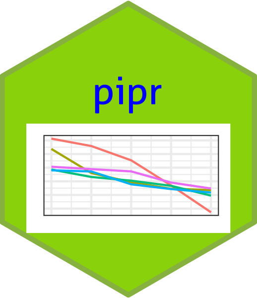

<!-- README.md is generated from README.Rmd. Please edit that file -->

<a href = "https://worldbank.github.io/pipr"></a>

# pipr <a href='https://worldbank.github.io/pipr/index.html'></a>

<!-- badges: start -->

[](https://github.com/worldbank/pipr/actions?workflow=R-CMD-check)
[](https://github.com/worldbank/pipr/actions)
[](https://github.com/worldbank/pipr/actions)
[](https://lifecycle.r-lib.org/articles/stages.html#experimental)
<!-- badges: end -->

The `pipr` package allows R users to compute poverty and inequality
indicators for more than 160 countries and regions from the World Bank’s
database of household surveys.

## Installation

You can install the development version from
[GitHub](https://github.com/) with:

``` r
# install.packages("devtools")
devtools::install_github("worldbank/pipr")
```

## Example

This is a basic example that shows how to retrieve some key poverty and
inequity statistics.

``` r
library(dplyr)
library(pipr)

df <- get_stats(country = "ALB")
glimpse(df)
#> Rows: 14
#> Columns: 40
#> $ region_name          <chr> "Europe and Central Asia", "Europe and Central As…
#> $ region_code          <chr> "ECA", "ECA", "ECA", "ECA", "ECA", "ECA", "ECA", …
#> $ country_name         <chr> "Albania", "Albania", "Albania", "Albania", "Alba…
#> $ country_code         <chr> "ALB", "ALB", "ALB", "ALB", "ALB", "ALB", "ALB", …
#> $ year                 <dbl> 1996, 2002, 2005, 2008, 2012, 2014, 2015, 2016, 2…
#> $ reporting_level      <chr> "national", "national", "national", "national", "…
#> $ survey_acronym       <chr> "EWS", "LSMS", "LSMS", "LSMS", "LSMS", "HBS", "HB…
#> $ survey_coverage      <chr> "national", "national", "national", "national", "…
#> $ welfare_time         <dbl> 1996, 2002, 2005, 2008, 2012, 2014, 2015, 2016, 2…
#> $ welfare_type         <chr> "consumption", "consumption", "consumption", "con…
#> $ survey_comparability <dbl> 0, 1, 1, 1, 1, 2, 2, 2, 4, 2, 4, 3, 4, 3
#> $ comparable_spell     <chr> "1996", "2002 - 2012", "2002 - 2012", "2002 - 201…
#> $ poverty_line         <dbl> 1.9, 1.9, 1.9, 1.9, 1.9, 1.9, 1.9, 1.9, 1.9, 1.9,…
#> $ headcount            <dbl> 0.009206690, 0.015708434, 0.008605271, 0.00313649…
#> $ poverty_gap          <dbl> 1.400507e-03, 2.617611e-03, 1.313255e-03, 5.12411…
#> $ poverty_severity     <dbl> 4.111228e-04, 7.940742e-04, 3.348323e-04, 1.31118…
#> $ watts                <dbl> 0.0016976386, 0.0032506353, 0.0015296081, 0.00059…
#> $ mean                 <dbl> 6.570821, 6.715828, 7.591930, 8.314345, 7.882867,…
#> $ median               <dbl> 5.774805, 5.539607, 6.460357, 6.957659, 6.825289,…
#> $ mld                  <dbl> 0.1191043, 0.1648116, 0.1544128, 0.1488934, 0.138…
#> $ gini                 <dbl> 0.2701034, 0.3173898, 0.3059566, 0.2998467, 0.289…
#> $ polarization         <dbl> 0.2412933, 0.2689816, 0.2545287, 0.2473111, 0.249…
#> $ decile1              <dbl> 0.03863286, 0.03494002, 0.03482536, 0.03733625, 0…
#> $ decile2              <dbl> 0.05289347, 0.04859444, 0.04920109, 0.05136781, 0…
#> $ decile3              <dbl> 0.06378683, 0.05842059, 0.05977283, 0.06088472, 0…
#> $ decile4              <dbl> 0.07322042, 0.06738204, 0.06921183, 0.06983584, 0…
#> $ decile5              <dbl> 0.08379662, 0.07653102, 0.07988158, 0.07912079, 0…
#> $ decile6              <dbl> 0.09354903, 0.08839459, 0.09037069, 0.08924133, 0…
#> $ decile7              <dbl> 0.1082309, 0.1022859, 0.1037214, 0.1029873, 0.105…
#> $ decile8              <dbl> 0.1247387, 0.1198443, 0.1212641, 0.1192908, 0.122…
#> $ decile9              <dbl> 0.1489955, 0.1492508, 0.1483394, 0.1453520, 0.148…
#> $ decile10             <dbl> 0.2121557, 0.2543564, 0.2434117, 0.2445831, 0.229…
#> $ cpi                  <dbl> 0.4445725, 0.7805330, 0.8387371, 0.9123323, 1.020…
#> $ ppp                  <dbl> 54.65258, 54.65258, 54.65258, 54.65258, 54.65258,…
#> $ pop                  <dbl> 3168033, 3051010, 3011487, 2947314, 2900401, 2889…
#> $ gdp                  <dbl> 1633.552, 2247.497, 2675.508, 3298.478, 3736.339,…
#> $ hfce                 <dbl> 1714.813, 1685.368, 2079.244, 2819.736, 2989.866,…
#> $ is_interpolated      <lgl> FALSE, FALSE, FALSE, FALSE, FALSE, FALSE, FALSE, …
#> $ distribution_type    <chr> "micro", "micro", "micro", "micro", "micro", "mic…
#> $ estimation_type      <chr> "survey", "survey", "survey", "survey", "survey",…
```
